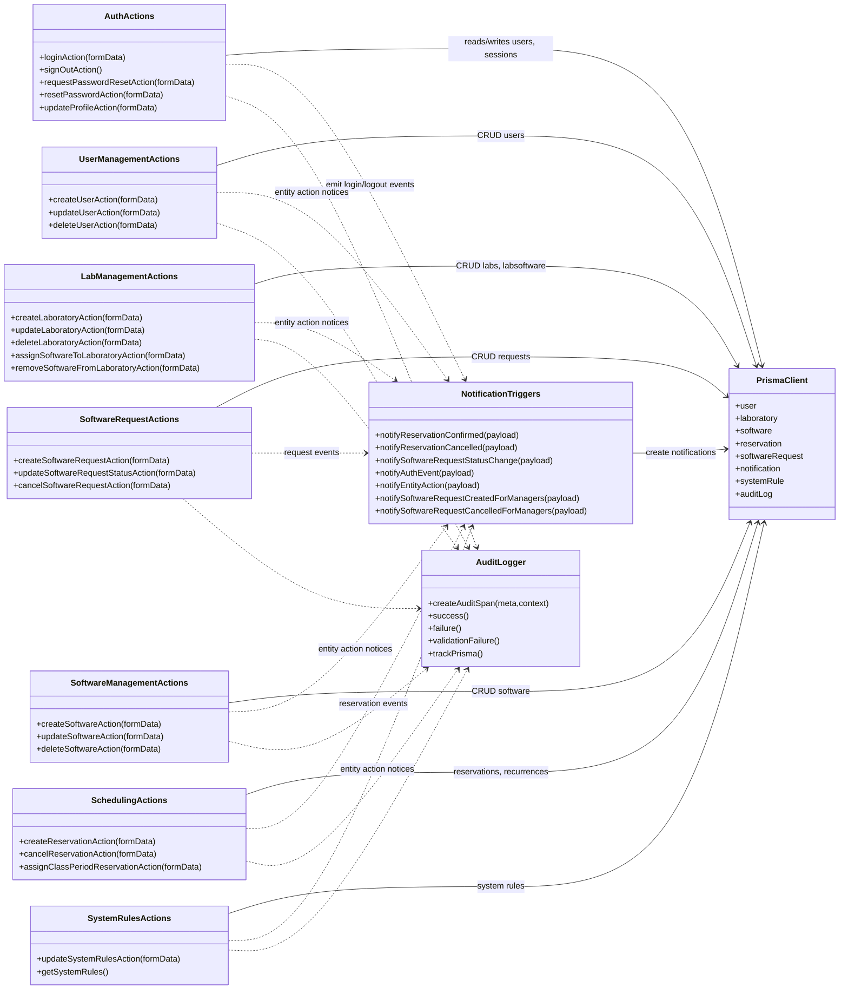

## Core Class/Module Diagram

```mermaid
classDiagram
  direction LR

  class AuthActions {
    +loginAction(formData)
    +signOutAction()
    +requestPasswordResetAction(formData)
    +resetPasswordAction(formData)
    +updateProfileAction(formData)
  }

  class UserManagementActions {
    +createUserAction(formData)
    +updateUserAction(formData)
    +deleteUserAction(formData)
  }

  class LabManagementActions {
    +createLaboratoryAction(formData)
    +updateLaboratoryAction(formData)
    +deleteLaboratoryAction(formData)
    +assignSoftwareToLaboratoryAction(formData)
    +removeSoftwareFromLaboratoryAction(formData)
  }

  class SoftwareManagementActions {
    +createSoftwareAction(formData)
    +updateSoftwareAction(formData)
    +deleteSoftwareAction(formData)
  }

  class SoftwareRequestActions {
    +createSoftwareRequestAction(formData)
    +updateSoftwareRequestStatusAction(formData)
    +cancelSoftwareRequestAction(formData)
  }

  class SchedulingActions {
    +createReservationAction(formData)
    +cancelReservationAction(formData)
    +assignClassPeriodReservationAction(formData)
  }

  class SystemRulesActions {
    +updateSystemRulesAction(formData)
    +getSystemRules()
  }

  class NotificationTriggers {
    +notifyReservationConfirmed(payload)
    +notifyReservationCancelled(payload)
    +notifySoftwareRequestStatusChange(payload)
    +notifyAuthEvent(payload)
    +notifyEntityAction(payload)
    +notifySoftwareRequestCreatedForManagers(payload)
    +notifySoftwareRequestCancelledForManagers(payload)
  }

  class PrismaClient {
    +user
    +laboratory
    +software
    +reservation
    +softwareRequest
    +notification
    +systemRule
    +auditLog
  }

  class AuditLogger {
    +createAuditSpan(meta,context)
    +success()
    +failure()
    +validationFailure()
    +trackPrisma()
  }

  AuthActions --> PrismaClient : reads/writes users, sessions
  UserManagementActions --> PrismaClient : CRUD users
  LabManagementActions --> PrismaClient : CRUD labs, labsoftware
  SoftwareManagementActions --> PrismaClient : CRUD software
  SoftwareRequestActions --> PrismaClient : CRUD requests
  SchedulingActions --> PrismaClient : reservations, recurrences
  SystemRulesActions --> PrismaClient : system rules
  NotificationTriggers --> PrismaClient : create notifications

  AuthActions ..> NotificationTriggers : emit login/logout events
  SchedulingActions ..> NotificationTriggers : reservation events
  SoftwareRequestActions ..> NotificationTriggers : request events
  UserManagementActions ..> NotificationTriggers : entity action notices
  LabManagementActions ..> NotificationTriggers : entity action notices
  SoftwareManagementActions ..> NotificationTriggers : entity action notices
  SystemRulesActions ..> NotificationTriggers : entity action notices

  AuthActions ..> AuditLogger
  UserManagementActions ..> AuditLogger
  LabManagementActions ..> AuditLogger
  SoftwareManagementActions ..> AuditLogger
  SoftwareRequestActions ..> AuditLogger
  SchedulingActions ..> AuditLogger
  SystemRulesActions ..> AuditLogger
```
