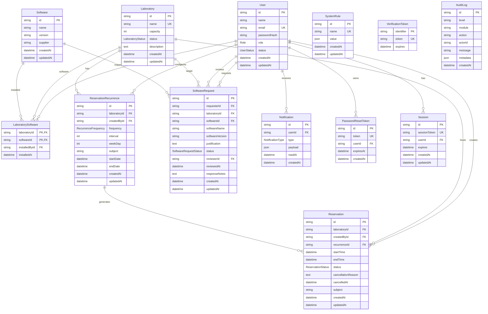

## Entity-Relationship Diagram

```mermaid
erDiagram
  User {
    string id PK
    string name
    string email UK
    string passwordHash
    Role role
    UserStatus status
    datetime createdAt
    datetime updatedAt
  }

  Laboratory {
    string id PK
    string name UK
    int capacity
    LaboratoryStatus status
    text description
    datetime createdAt
    datetime updatedAt
  }

  Software {
    string id PK
    string name
    string version
    string supplier
    datetime createdAt
    datetime updatedAt
  }

  LaboratorySoftware {
    string laboratoryId PK,FK
    string softwareId PK,FK
    string installedById FK
    datetime installedAt
  }

  Reservation {
    string id PK
    string laboratoryId FK
    string createdById FK
    string recurrenceId FK
    datetime startTime
    datetime endTime
    ReservationStatus status
    text cancellationReason
    datetime cancelledAt
    string subject
    datetime createdAt
    datetime updatedAt
  }

  ReservationRecurrence {
    string id PK
    string laboratoryId FK
    string createdById FK
    RecurrenceFrequency frequency
    int interval
    int weekDay
    string subject
    datetime startDate
    datetime endDate
    datetime createdAt
    datetime updatedAt
  }

  SoftwareRequest {
    string id PK
    string requesterId FK
    string laboratoryId FK
    string softwareId FK
    string softwareName
    string softwareVersion
    text justification
    SoftwareRequestStatus status
    string reviewerId FK
    datetime reviewedAt
    text responseNotes
    datetime createdAt
    datetime updatedAt
  }

  SystemRule {
    string id PK
    string name UK
    json value
    datetime createdAt
    datetime updatedAt
  }

  Notification {
    string id PK
    string userId FK
    NotificationType type
    json payload
    datetime readAt
    datetime createdAt
  }

  PasswordResetToken {
    string id PK
    string token UK
    string userId FK
    datetime expiresAt
    datetime createdAt
  }

  Session {
    string id PK
    string sessionToken UK
    string userId FK
    datetime expires
    datetime createdAt
    datetime updatedAt
  }

  VerificationToken {
    string identifier PK
    string token UK
    datetime expires
  }

  AuditLog {
    string id PK
    string level
    string module
    string action
    string actorId
    string message
    json metadata
    datetime createdAt
  }

  User ||--o{ Reservation : "creates"
  User ||--o{ SoftwareRequest : "requests"
  User ||--o{ SoftwareRequest : "reviews"
  User ||--o{ Notification : "receives"
  User ||--o{ PasswordResetToken : "owns"
  User ||--o{ LaboratorySoftware : "installs"
  User ||--o{ ReservationRecurrence : "configures"
  User ||--o{ Session : "has"

  Laboratory ||--o{ Reservation : "hosts"
  Laboratory ||--o{ ReservationRecurrence : "has"
  Laboratory ||--o{ SoftwareRequest : "target"
  Laboratory ||--o{ LaboratorySoftware : "software"

  Software ||--o{ SoftwareRequest : "requested"
  Software ||--o{ LaboratorySoftware : "installed"

  ReservationRecurrence ||--o{ Reservation : "generates"
```
