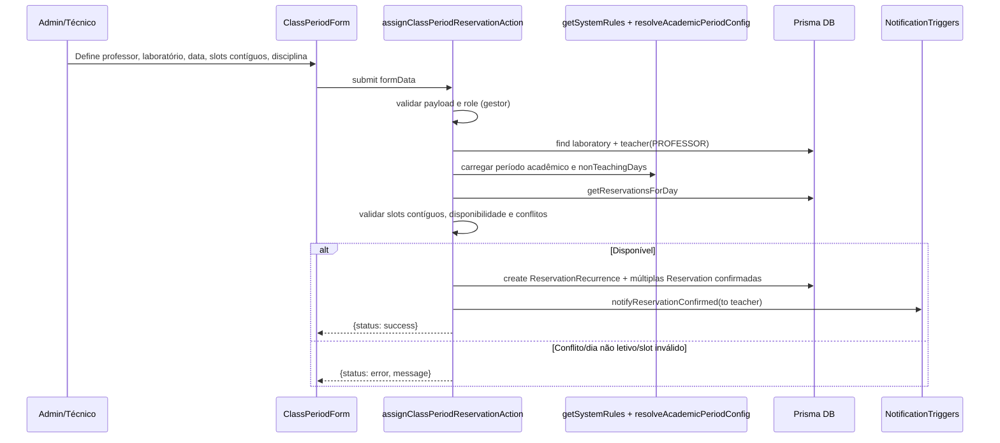

## Agendar Período Letivo Completo

```mermaid
sequenceDiagram
  participant Manager as Admin/Técnico
  participant UI as ClassPeriodForm
  participant Action as assignClassPeriodReservationAction
  participant Rules as getSystemRules + resolveAcademicPeriodConfig
  participant DB as Prisma DB
  participant Notif as NotificationTriggers

  Manager->>UI: Define professor, laboratório, data, slots contíguos, disciplina
  UI->>Action: submit formData
  Action->>Action: validar payload e role (gestor)
  Action->>DB: find laboratory + teacher(PROFESSOR)
  Action->>Rules: carregar período acadêmico e nonTeachingDays
  Action->>DB: getReservationsForDay
  Action->>Action: validar slots contíguos, disponibilidade e conflitos
  alt Disponível
    Action->>DB: create ReservationRecurrence + múltiplas Reservation confirmadas
    Action->>Notif: notifyReservationConfirmed(to teacher)
    Action-->>UI: {status: success}
  else Conflito/dia não letivo/slot inválido
    Action-->>UI: {status: error, message}
  end
```
