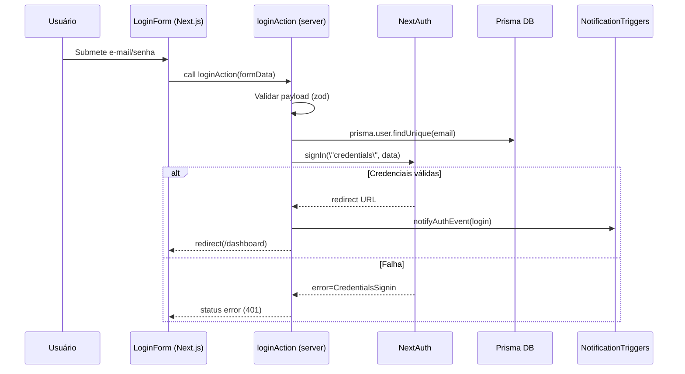

## Login Sequence

```mermaid
sequenceDiagram
  participant U as Usuário
  participant UI as LoginForm (Next.js)
  participant Auth as loginAction (server)
  participant NextAuth as NextAuth
  participant DB as Prisma DB
  participant Notif as NotificationTriggers

  U->>UI: Submete e-mail/senha
  UI->>Auth: call loginAction(formData)
  Auth->>Auth: Validar payload (zod)
  Auth->>DB: prisma.user.findUnique(email)
  Auth->>NextAuth: signIn(\"credentials\", data)
  alt Credenciais válidas
    NextAuth-->>Auth: redirect URL
    Auth->>Notif: notifyAuthEvent(login)
    Auth-->>UI: redirect(/dashboard)
  else Falha
    NextAuth-->>Auth: error=CredentialsSignin
    Auth-->>UI: status error (401)
  end
```
