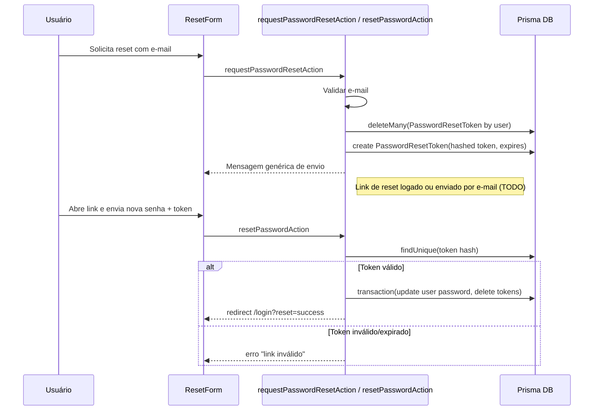

## Password Reset Sequence

```mermaid
sequenceDiagram
  participant U as Usuário
  participant UI as ResetForm
  participant Auth as requestPasswordResetAction / resetPasswordAction
  participant DB as Prisma DB

  U->>UI: Solicita reset com e-mail
  UI->>Auth: requestPasswordResetAction
  Auth->>Auth: Validar e-mail
  Auth->>DB: deleteMany(PasswordResetToken by user)
  Auth->>DB: create PasswordResetToken(hashed token, expires)
  Auth-->>UI: Mensagem genérica de envio
  note right of Auth: Link de reset logado ou enviado por e-mail (TODO)

  U->>UI: Abre link e envia nova senha + token
  UI->>Auth: resetPasswordAction
  Auth->>DB: findUnique(token hash)
  alt Token válido
    Auth->>DB: transaction(update user password, delete tokens)
    Auth-->>UI: redirect /login?reset=success
  else Token inválido/expirado
    Auth-->>UI: erro "link inválido"
  end
```
