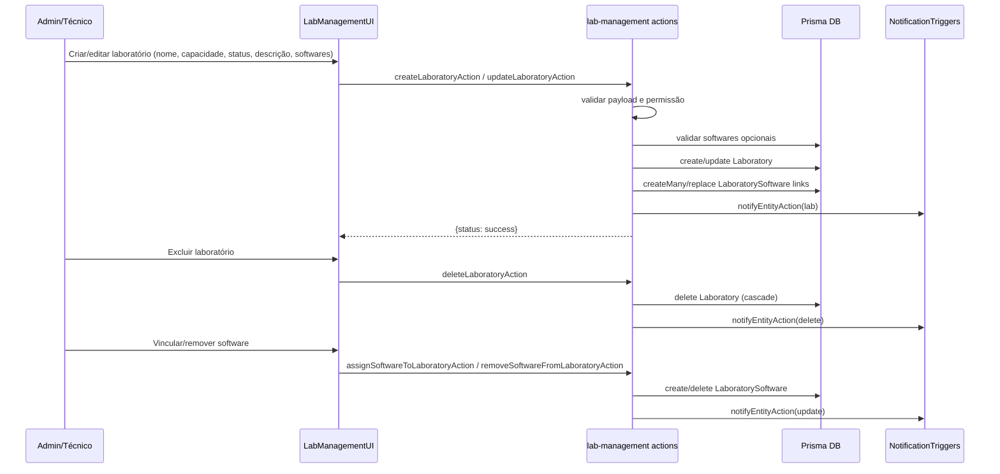

## Gestão de Laboratórios

```mermaid
sequenceDiagram
  participant Manager as Admin/Técnico
  participant UI as LabManagementUI
  participant Action as lab-management actions
  participant DB as Prisma DB
  participant Notif as NotificationTriggers

  Manager->>UI: Criar/editar laboratório (nome, capacidade, status, descrição, softwares)
  UI->>Action: createLaboratoryAction / updateLaboratoryAction
  Action->>Action: validar payload e permissão
  Action->>DB: validar softwares opcionais
  Action->>DB: create/update Laboratory
  Action->>DB: createMany/replace LaboratorySoftware links
  Action->>Notif: notifyEntityAction(lab)
  Action-->>UI: {status: success}

  Manager->>UI: Excluir laboratório
  UI->>Action: deleteLaboratoryAction
  Action->>DB: delete Laboratory (cascade)
  Action->>Notif: notifyEntityAction(delete)

  Manager->>UI: Vincular/remover software
  UI->>Action: assignSoftwareToLaboratoryAction / removeSoftwareFromLaboratoryAction
  Action->>DB: create/delete LaboratorySoftware
  Action->>Notif: notifyEntityAction(update)
```
