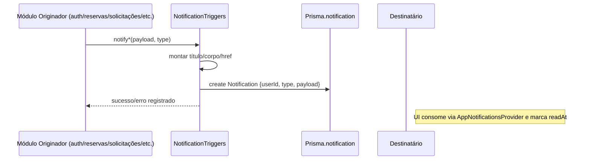

## Disparo de Notificações

```mermaid
sequenceDiagram
  participant Module as Módulo Originador (auth/reservas/solicitações/etc.)
  participant Trigger as NotificationTriggers
  participant DB as Prisma.notification
  participant User as Destinatário

  Module->>Trigger: notify*(payload, type)
  Trigger->>Trigger: montar título/corpo/href
  Trigger->>DB: create Notification {userId, type, payload}
  Trigger-->>Module: sucesso/erro registrado
  Note right of User: UI consome via AppNotificationsProvider e marca readAt
```
