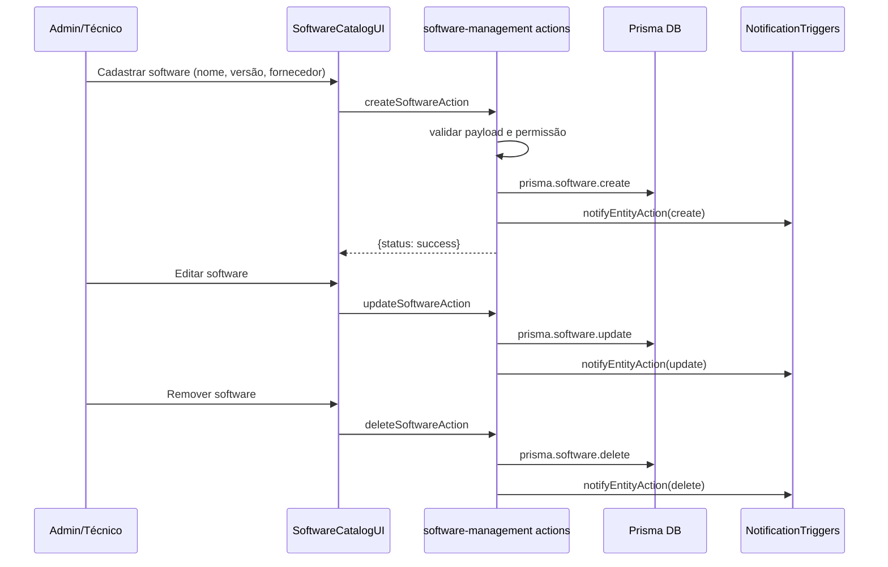

## Catálogo de Software

```mermaid
sequenceDiagram
  participant Manager as Admin/Técnico
  participant UI as SoftwareCatalogUI
  participant Action as software-management actions
  participant DB as Prisma DB
  participant Notif as NotificationTriggers

  Manager->>UI: Cadastrar software (nome, versão, fornecedor)
  UI->>Action: createSoftwareAction
  Action->>Action: validar payload e permissão
  Action->>DB: prisma.software.create
  Action->>Notif: notifyEntityAction(create)
  Action-->>UI: {status: success}

  Manager->>UI: Editar software
  UI->>Action: updateSoftwareAction
  Action->>DB: prisma.software.update
  Action->>Notif: notifyEntityAction(update)

  Manager->>UI: Remover software
  UI->>Action: deleteSoftwareAction
  Action->>DB: prisma.software.delete
  Action->>Notif: notifyEntityAction(delete)
```
