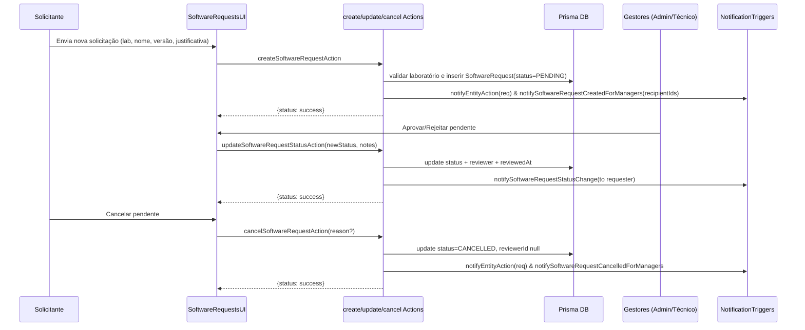

## Ciclo de Solicitação de Software

```mermaid
sequenceDiagram
  participant Req as Solicitante
  participant UI as SoftwareRequestsUI
  participant Action as create/update/cancel Actions
  participant DB as Prisma DB
  participant Managers as Gestores (Admin/Técnico)
  participant Notif as NotificationTriggers

  Req->>UI: Envia nova solicitação (lab, nome, versão, justificativa)
  UI->>Action: createSoftwareRequestAction
  Action->>DB: validar laboratório e inserir SoftwareRequest(status=PENDING)
  Action->>Notif: notifyEntityAction(req) & notifySoftwareRequestCreatedForManagers(recipientIds)
  Action-->>UI: {status: success}

  Managers->>UI: Aprovar/Rejeitar pendente
  UI->>Action: updateSoftwareRequestStatusAction(newStatus, notes)
  Action->>DB: update status + reviewer + reviewedAt
  Action->>Notif: notifySoftwareRequestStatusChange(to requester)
  Action-->>UI: {status: success}

  Req->>UI: Cancelar pendente
  UI->>Action: cancelSoftwareRequestAction(reason?)
  Action->>DB: update status=CANCELLED, reviewerId null
  Action->>Notif: notifyEntityAction(req) & notifySoftwareRequestCancelledForManagers
  Action-->>UI: {status: success}
```
