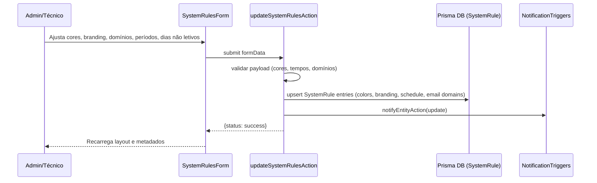

## Atualizar Regras do Sistema

```mermaid
sequenceDiagram
  participant Admin as Admin/Técnico
  participant UI as SystemRulesForm
  participant Action as updateSystemRulesAction
  participant DB as Prisma DB (SystemRule)
  participant Notif as NotificationTriggers

  Admin->>UI: Ajusta cores, branding, domínios, períodos, dias não letivos
  UI->>Action: submit formData
  Action->>Action: validar payload (cores, tempos, domínios)
  Action->>DB: upsert SystemRule entries (colors, branding, schedule, email domains)
  Action->>Notif: notifyEntityAction(update)
  Action-->>UI: {status: success}
  UI-->>Admin: Recarrega layout e metadados
```
