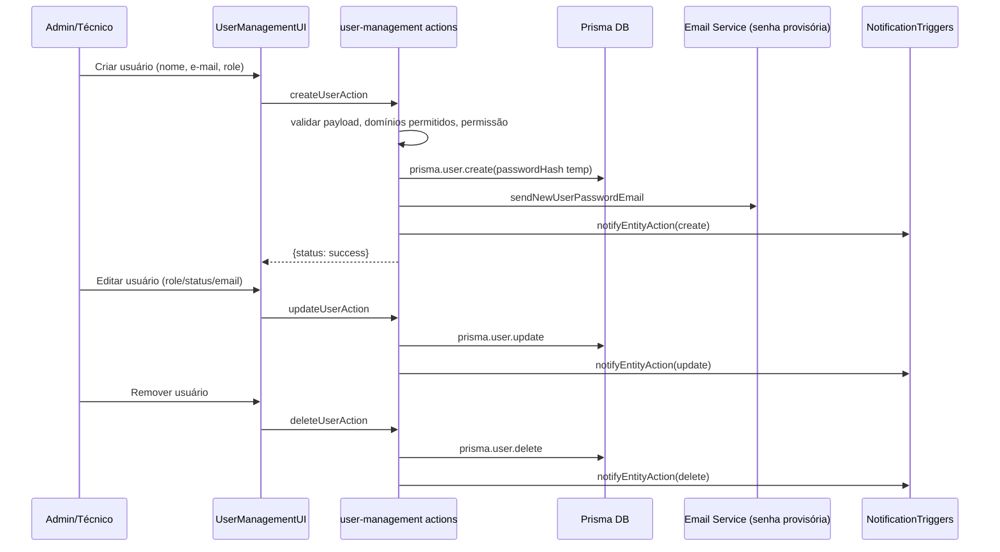

## Gestão de Usuários

```mermaid
sequenceDiagram
  participant Admin as Admin/Técnico
  participant UI as UserManagementUI
  participant Action as user-management actions
  participant DB as Prisma DB
  participant Mail as Email Service (senha provisória)
  participant Notif as NotificationTriggers

  Admin->>UI: Criar usuário (nome, e-mail, role)
  UI->>Action: createUserAction
  Action->>Action: validar payload, domínios permitidos, permissão
  Action->>DB: prisma.user.create(passwordHash temp)
  Action->>Mail: sendNewUserPasswordEmail
  Action->>Notif: notifyEntityAction(create)
  Action-->>UI: {status: success}

  Admin->>UI: Editar usuário (role/status/email)
  UI->>Action: updateUserAction
  Action->>DB: prisma.user.update
  Action->>Notif: notifyEntityAction(update)

  Admin->>UI: Remover usuário
  UI->>Action: deleteUserAction
  Action->>DB: prisma.user.delete
  Action->>Notif: notifyEntityAction(delete)
```
