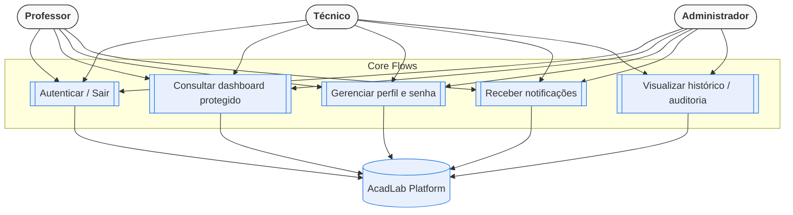

## High-Level Use Case Diagram

```mermaid
flowchart TB
  classDef actor fill:#f9f9f9,stroke:#333,stroke-width:1px,font-weight:bold;
  classDef usecase fill:#e8f0fe,stroke:#1a73e8,stroke-width:1px;

  User([Professor]):::actor
  Technician([Técnico]):::actor
  Admin([Administrador]):::actor
  System[(AcadLab Platform)]:::usecase

  subgraph Core Flows
    UC1[[Autenticar / Sair]]:::usecase
    UC2[[Consultar dashboard protegido]]:::usecase
    UC3[[Gerenciar perfil e senha]]:::usecase
    UC4[[Receber notificações]]:::usecase
    UC5[[Visualizar histórico / auditoria]]:::usecase
  end

  User --> UC1
  Technician --> UC1
  Admin --> UC1

  User --> UC2
  Technician --> UC2
  Admin --> UC2

  User --> UC3
  Technician --> UC3
  Admin --> UC3

  UC4 --> System
  User --> UC4
  Technician --> UC4
  Admin --> UC4

  Admin --> UC5
  Technician --> UC5
  UC5 --> System
  UC2 --> System
  UC3 --> System
  UC1 --> System
```
