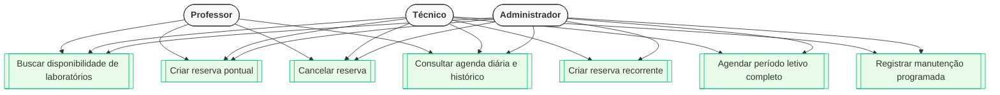

## Scheduling Use Cases

```mermaid
flowchart TB
  classDef actor fill:#f9f9f9,stroke:#333,stroke-width:1px,font-weight:bold;
  classDef usecase fill:#e7fbe8,stroke:#10b981,stroke-width:1px;

  User([Professor]):::actor
  Technician([Técnico]):::actor
  Admin([Administrador]):::actor

  UC1[[Buscar disponibilidade de laboratórios]]:::usecase
  UC2[[Criar reserva pontual]]:::usecase
  UC3[[Criar reserva recorrente]]:::usecase
  UC4[[Cancelar reserva]]:::usecase
  UC5[[Agendar período letivo completo]]:::usecase
  UC6[[Registrar manutenção programada]]:::usecase
  UC7[[Consultar agenda diária e histórico]]:::usecase

  User --> UC1
  User --> UC2
  User --> UC4
  User --> UC7

  Technician --> UC1
  Technician --> UC2
  Technician --> UC3
  Technician --> UC4
  Technician --> UC5
  Technician --> UC6
  Technician --> UC7

  Admin --> UC1
  Admin --> UC2
  Admin --> UC3
  Admin --> UC4
  Admin --> UC5
  Admin --> UC6
  Admin --> UC7
```
