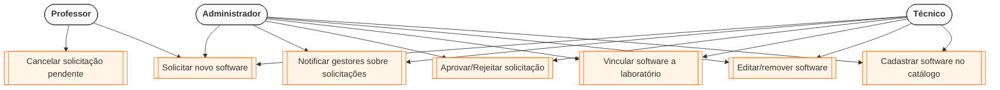

## Software & Requests Use Cases

```mermaid
flowchart TB
  classDef actor fill:#f9f9f9,stroke:#333,stroke-width:1px,font-weight:bold;
  classDef usecase fill:#fff4e5,stroke:#f97316,stroke-width:1px;

  User([Professor]):::actor
  Technician([Técnico]):::actor
  Admin([Administrador]):::actor

  UC1[[Cadastrar software no catálogo]]:::usecase
  UC2[[Editar/remover software]]:::usecase
  UC3[[Vincular software a laboratório]]:::usecase
  UC4[[Solicitar novo software]]:::usecase
  UC5[[Aprovar/Rejeitar solicitação]]:::usecase
  UC6[[Cancelar solicitação pendente]]:::usecase
  UC7[[Notificar gestores sobre solicitações]]:::usecase

  Technician --> UC1
  Technician --> UC2
  Technician --> UC3
  Technician --> UC5
  Technician --> UC7

  Admin --> UC1
  Admin --> UC2
  Admin --> UC3
  Admin --> UC5
  Admin --> UC7

  User --> UC4
  User --> UC6
  Technician --> UC4
  Admin --> UC4
```
